# OpenXComZX

Порт **OpenXcom** (X-COM: UFO Defense и Terror from the Deep) на **TS-Config** —
ZX Evolution / Pentevo: Z80 до 14 МГц, 4 МБ страничной памяти, аппаратные тайлы,
спрайты и DMA. Музыка — AY / TurboSound / YM2203, опционально плата OPL3 (YMF262).

Порт сильно адаптирован под железо, но повторяет оригинал: те же правила, те же
формулы, те же мелочи интерфейса. Данные берутся из копии игры пользователя —
их конвертирует утилита на ПК, в репозитории оригинальных данных нет.

## Как это выглядит

Снимки с эмулятора, игра — Terror from the Deep.

|  |  |  |
|---|---|---|
| [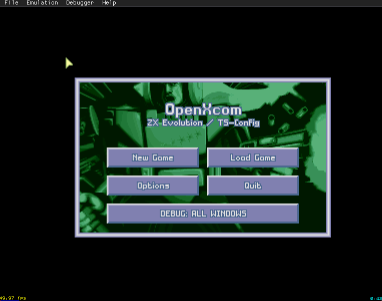](project_docs/scr/Screenshot_2.png)<br>Главное меню | [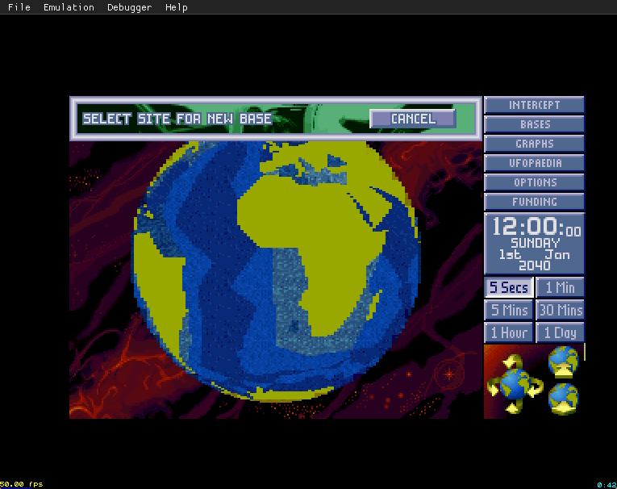](project_docs/scr/Screenshot_3.png)<br>Выбор места для первой базы | [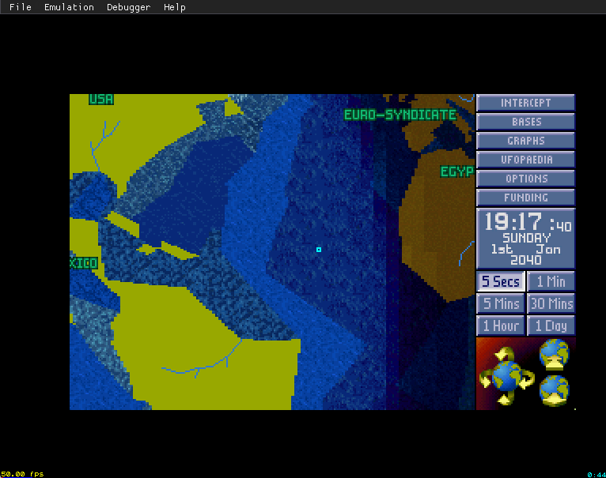](project_docs/scr/Screenshot_4.png)<br>Глобус: регионы, тень, метки |
| [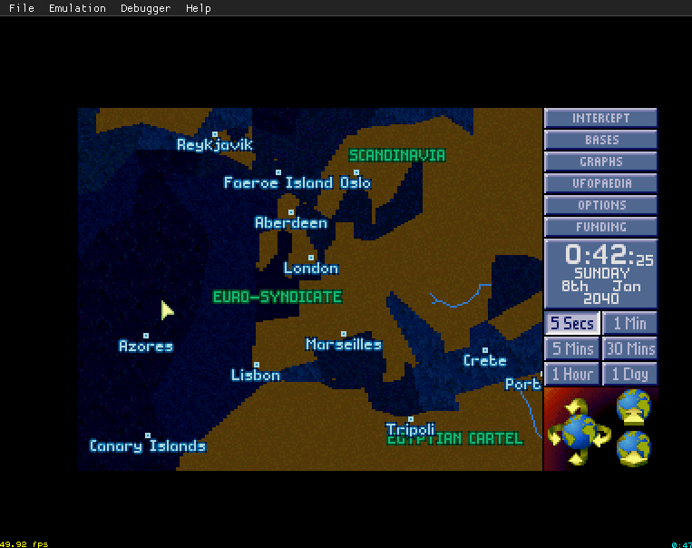](project_docs/scr/Screenshot_8.png)<br>Глобус вблизи: города и страны | [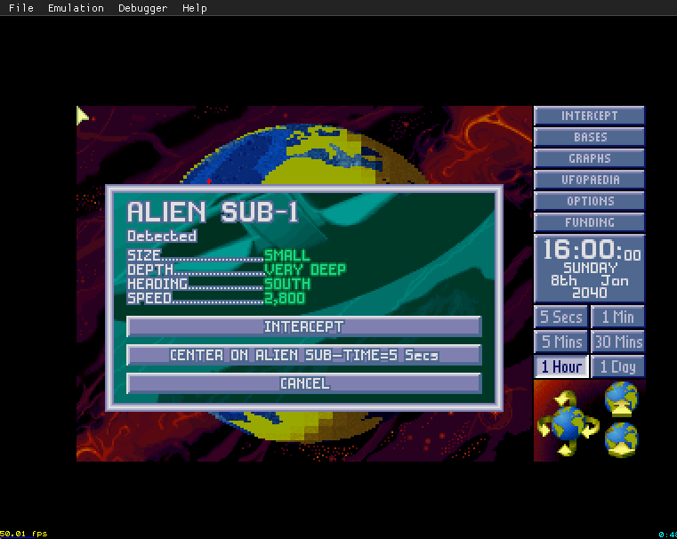](project_docs/scr/Screenshot_9.png)<br>Обнаружена подлодка пришельцев | [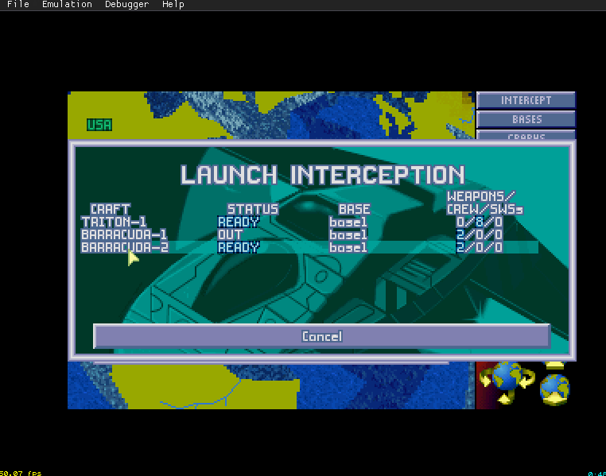](project_docs/scr/Screenshot_10.png)<br>Запуск перехвата |
| [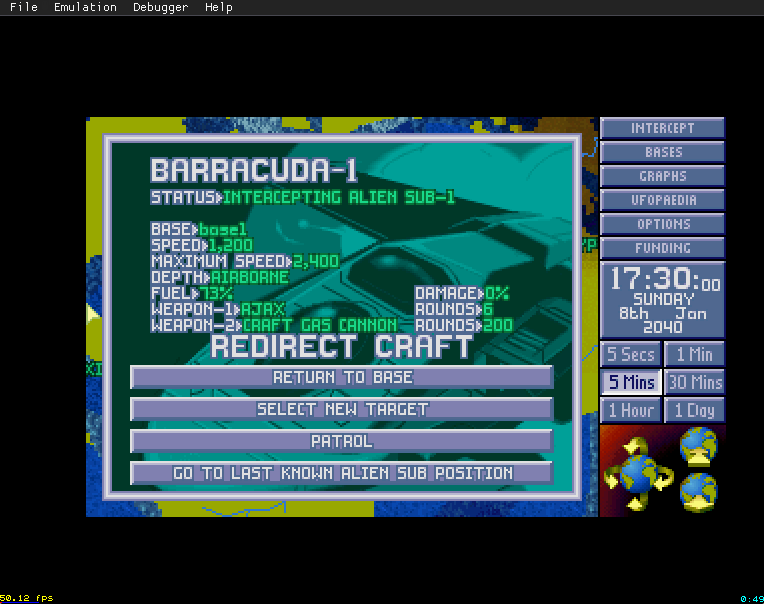](project_docs/scr/Screenshot_11.png)<br>Корабль в полёте: смена приказа | [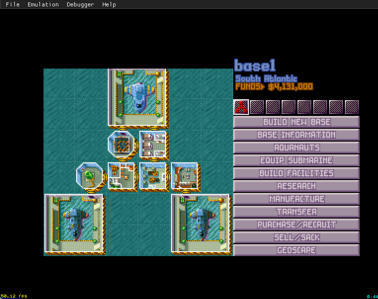](project_docs/scr/Screenshot_5.png)<br>База | [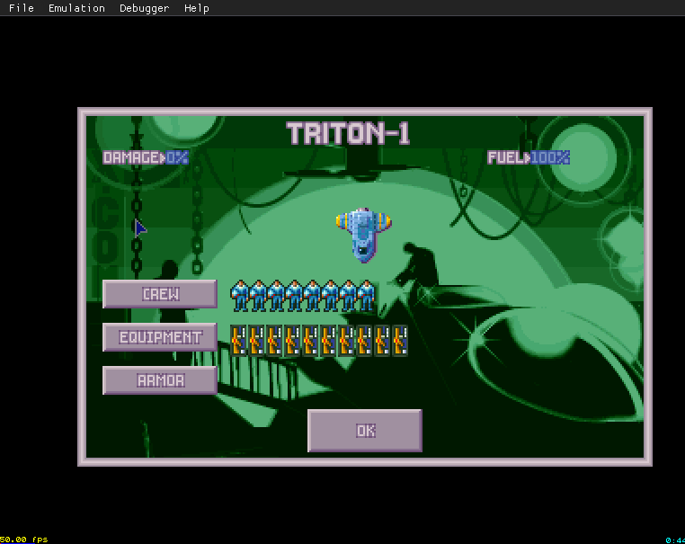](project_docs/scr/Screenshot_6.png)<br>Снаряжение «Тритона» |
| [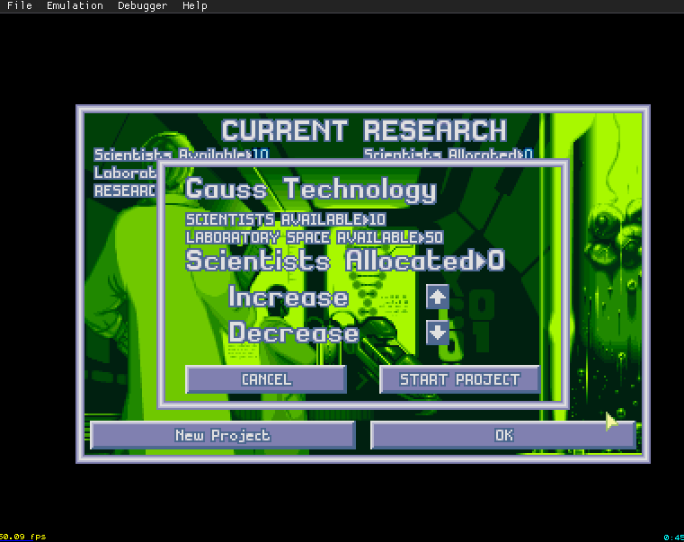](project_docs/scr/Screenshot_7.png)<br>Исследования: распределение учёных | [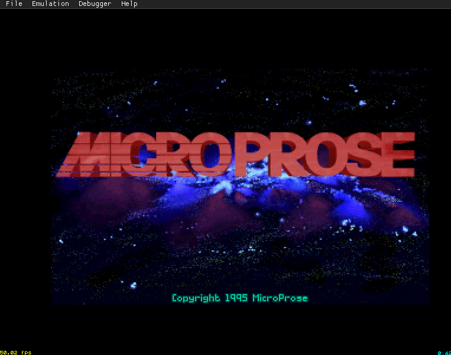](project_docs/scr/Screenshot_1.png)<br>Заставка |  |

## Что уже работает

| Часть | Состояние |
|---|---|
| Геоскейп | глобус с тенью и метками, время, обнаружение и полёты НЛО, перехват, воздушный бой, места миссий и базы пришельцев, конец месяца, счёт и концовки |
| Базы | строительство, экипировка, склад, переводы, исследования и производство, экономика, инвентарь бойца |
| Уфопедия | статьи всех разделов |
| Наземный бой | генератор карты по `mapScript`, отрисовка изометрии, отряд с корабля, ходьба с учётом стен, дверей и этажей, приседание, панель |
| Сохранения | в память эмулятора; на SD-карту — в работе |
| Звук | музыка четырьмя способами вывода, конвертер из ADLIB/MIDI |

Чего пока нет: пришельцы и стрельба в бою, видимость и туман войны, разбор после
боя, звуковые эффекты. Подробный список — [project_docs/14_todo.md](project_docs/14_todo.md).

## Сборка

Нужны:

- **SDCC 4.5** (`sdcc`, `sdasz80`, `sdldz80` в `PATH`);
- **Node.js** — скрипты сборки и проверки;
- **.NET Framework 4.8** — конвертер данных `OxzConv` (C#);
- копия **X-COM: UFO Defense** или **Terror from the Deep** (например, из Steam)
  в каталоге `Steam/` — данные игры, они не распространяются;
- эмулятор **Unreal Speccy** с поддержкой TS-Config — для запуска и тестов.

```powershell
powershell -File tools\build.ps1              # TFTD (по умолчанию)
powershell -File tools\build.ps1 -Game UFO    # UFO
```

Сборка собирает ядро и банки, гоняет проверки раскладки памяти, конвертирует данные
игры и делает образ SD-карты. Результат — `tmp\build\oxz.spg`.

```powershell
powershell -File tools\run.ps1                # запустить в эмуляторе
powershell -File tools\runtests.ps1           # все автотесты
```

Автотесты — сценарии в `tests\*.oxs`: эмулятор проигрывает нажатия, сверяет память
и делает снимки экрана. Код выхода 0 — тест прошёл.

## Из чего состоит

| Каталог | Что внутри |
|---|---|
| `src/kernel/` | ядро: старт, прерывания, страницы, дальняя память, ресурсы, текст, SD-карта (Win0 — только ассемблер) |
| `src/common/` | интерфейс, общий для геоскейпа и боя: виджеты, меню, Уфопедия |
| `src/geoscape/` | кампания: время, месяц, сохранение; `earth/` — глобус, окна геоскейпа, НЛО и корабли; `base/` — базы, лаборатория, производство, экономика |
| `src/battlescape/` | наземный бой: генератор карты, отрисовка, бойцы, поиск пути, двери |
| `OxzConv/` | конвертер данных игры в формат порта (C#) |
| `tools/` | сборка, запуск, тесты, замеры, вспомогательные скрипты |
| `tests/` | сценарии автотестов |
| `project_docs/` | вся проектная документация — [оглавление](project_docs/README.md) |

Код на C собирается в банки по 16 КБ (`tools\build.ps1`, массив `$banks`),
раскладка памяти описана в [src/map.h](src/map.h) и
[project_docs/08_ui_port_plan.md](project_docs/08_ui_port_plan.md) §4.

## Происхождение

Порт написан по исходникам [OpenXcom](https://github.com/OpenXcom/OpenXcom)
(GPL-3.0) — открытой реализации движка X-COM. Оригинальные данные игры
(графика, звук, тексты) принадлежат правообладателям и в репозиторий не входят:
их нужно взять из своей копии игры.
